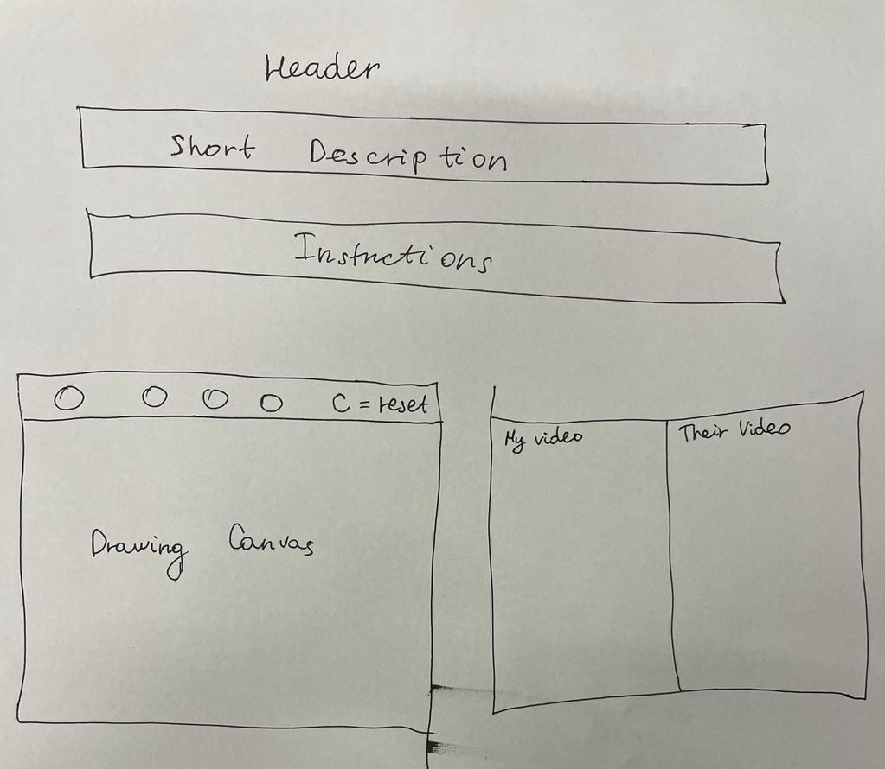
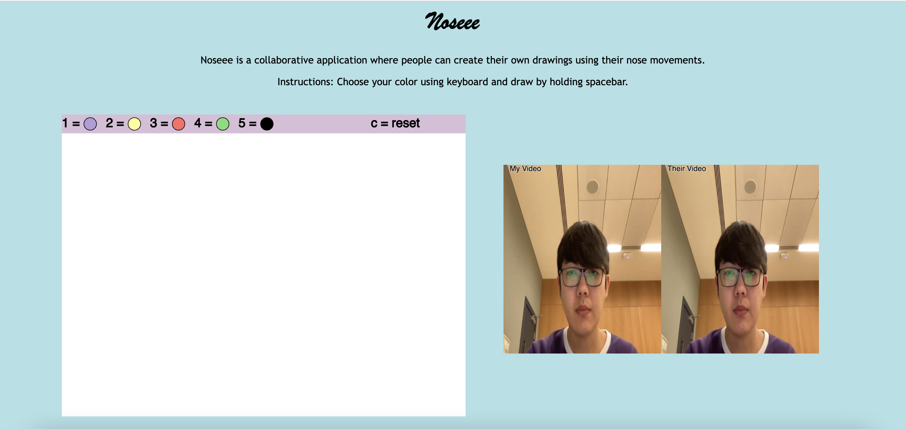
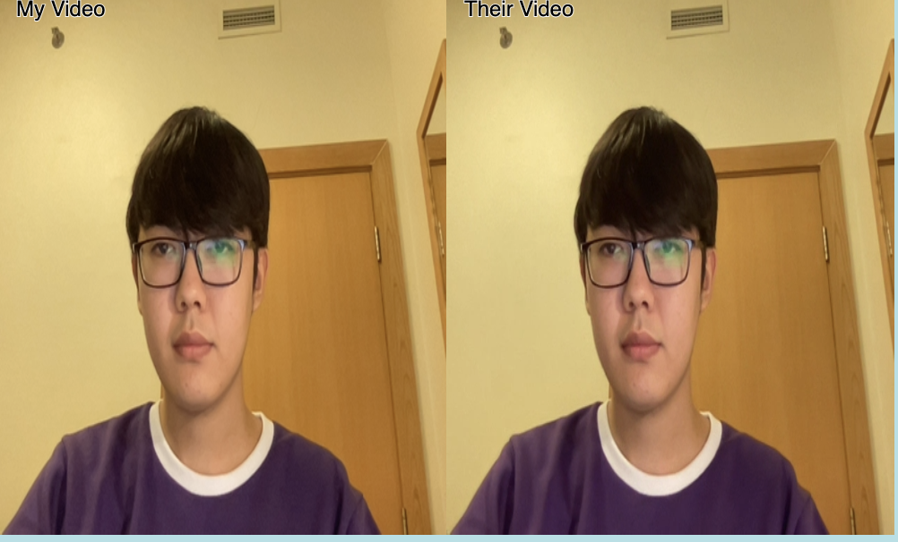

# Documentation of Noseee

## Working Link: https://noseee.glitch.me/

Presentation Link: https://docs.google.com/presentation/d/1DXTghxZiVpyEJUIJzDs3pPspVz1BhG2Na4hCEOvmmDg/edit#slide=id.p

## Project Description

## Overview
Noseee is an online real-time collaborative application where people can create their own drawings using their nose movements. The project uses Socket.io for realtime multiplayer connections, ML5 client-side javascript library for identifyng the coordinates of nose position by PoseNet and WebRTC for streaming the videos of players. Users can choose the color of the  brush by clicking numbers on keyboard and clean the drawing space with "c" keypress.

## Idea, Concept and Inspiration

I decided to try something new and create a project using p5 and ml5 client side javascript libraries. The idea was to create a colloborative application where different users could contribute in some way to the common form of art or composition. After some brainstorming I thought that creating an app which stimulates some physical activity would be a good idea. But dragging the mouse is not a big deal, right? I need something more interesting and potentially useful. As a CS major I use my laptop for more than 10 hours every day. Unsurprisingly, I started to experience neck and back pain because of countless hours staring at a computer screen. Naturally, you will begin to experience fatigue staying in the same position for hours, which then leads to bad posture and a strain on your cervical vertebrae. This is the cause of upper back and neck pain, sore shoulders and even lumbar pain in your lower back. Millions of other people across the world experience the same symptoms but not everyone can notice it and take decisive actions to confront it. That's how I came across the idea of using the users's nose position to draw on this application. Noseee will not only be an entertaining break for users but will also stimulate their neck muscles with physical activity.

## Wireframing
I created a simple wireframe of the website before strating the development process.

## User Experience & Design
User Interface of my appliaction is pretty straightforward: header, short descripton of the project and user instructions on the top of the page. It has 2 canvas: 
1) Drawing Canvas 
2) Real-time Video Communication Panel

Users can choose the color of the  brush by clicking numbers on keyboard and start drawing by holding spacebar. You can draw almost anything with this app! You can collaborate with your friend and come up with an abstract form of composition. If you want to clear the drawing canvas just press "c" on the keyboard it will automatically clean up drawing space for both users. 

### Below is the sample of UI&UX:

### User Testing
During user testing in class, I received various feedback from my classmates, and it was really helpful when making some design and development decisions.
Initially, I did not have any user control for drawing, it was drawing all the time. But I recieved a feedback about this and decided to add functionality to utilize the spacebar for drawing. 
Hasibur pointed out a bug where if the user goes out of the frame it draws random lines, it was  due to not confirming that poseNet is getting the poses of the user. It was successfully resolved by adding this code for confirming if the poseNet is getting the pose coordinates through the video.

    function gotPoses(poses) {
      if (poses.length > 0) {
        currPose = poses[0].pose;
      }
    }

I also received some feedback about using finger or hand to draw instead of the nose movements. But because I wanted to develop an application that is potentially useful. I decided to keep my initial idea of stimulating user's neck muscles with physical activity.

## Technical Design and What I learned from this Final Project

### Socket.io

Sockets was added to the HTTP server that was built over the express app. This application uses socket.io for the realtime sharing of information between the server and the clients. Having a drawing element and visual communictaion required me to make all the information exchange as realtime as possible, and sockets had a huge role in helping me do so.

    // Express is a node module for building HTTP servers
    let express = require("express");
    let http = require("http");
    let app = express();

    // We pass in the Express object and the options object
    let httpServer = http.createServer(app);

    // WebSocket Portion
    // WebSockets work with the HTTP server

    let io = require("socket.io");
    io = new io.Server(httpServer);
    
Using sockets I was able to receive the realtime nose positions of different players and the selected color using nosePos variable, and then send the data to all clients, including itself on the server side.

    if (currPose) {
    noseX = lerp(noseX, currPose.nose.x, 0.7);
    noseY = lerp(noseY, currPose.nose.y, 0.7);

    d = dist(
      currPose.leftEye.x,
      currPose.leftEye.y,
      currPose.rightEye.x,
      currPose.rightEye.y
    );

    noStroke();
    colorBox();

    image(canvas2, 0, 0);
    canvas2.noStroke();

    // users can choose from 5 different colors in the colorbox above the drawing canvas
    for (i = 0; i < 5; i++) {
      if (key == i + 1) {
        currColor = i;
        canvas2.fill(colors[i]); // searches for the selected color in array
      }
    }
    // after all the needed variables were assigned the nosePos data is emitted to socket
    let nosePos = { x: noseX, y: noseY, dist: d, color: colors[currColor] };

When the user pressed the spacebar the "data" message would be emitted and nosePos will be passed as argument to drawPos() function which will draw the sketch for both clients. Similarly, to clean the drawing space for both clients I seperately emitted "clean" message when the "c" keyboard was pressed. Server side code for exchanging data:

    // //Listen for a message named 'data' from this client
      socket.on("data", function (data) {
        //checking if data was received
        console.log("Received: 'data' " + data);

        //Send the data to all clients, including this one
        //Set the name of the message to be 'data'
        io.sockets.emit("data", data);
      });
      
      //Listen for message named "clear" from client
      socket.on("clear", ()=>{
      //Send the clear message to all clients, including this one
      io.sockets.emit("clear");
      });

### ML5 and PoseNet

ML5 is a client side library that provides access to machine learning algorithms and models in the browser, building on top of TensorFlow.js with no other external dependencies. In my project I utilized the PoseNet a machine learning model that allows for Real-time Human Pose Estimation. I was able to link the video of the user and get the real-time nose positions using below code:

      video = createCapture(VIDEO);
      video.hide();

      //PoseNet is a machine learning model that allows for Real-time Human Pose Estimation.
      poseNet = ml5.poseNet(video, modelReady);
      poseNet.flipHorizontal = 1;
      poseNet.on("pose", gotPoses);
      
After confirming that the poseNet is getting the pose coordinates through the video, I stored the x and y coordinates of nose position and dist variable for higher accuracy when sketching:

        noseX = lerp(noseX, currPose.nose.x, 0.7);
        noseY = lerp(noseY, currPose.nose.y, 0.7);

        d = dist(
          currPose.leftEye.x,
          currPose.leftEye.y,
          currPose.rightEye.x,
          currPose.rightEye.y
        );
        
After receiving the nosePos I put an if statement to check if user pressed spacebar, if yes then I called function drawPos(nosePos) which draws the sketch based on nose movements for both users:

        // drawing the sketch using nose position of the user and the color selected
        function drawPos(nosePos) {
          image(canvas2, 0, 0);
          canvas2.noStroke();
          canvas2.fill(nosePos.color);
          canvas2.ellipse(nosePos.x, nosePos.y, nosePos.dist * 0.2);
          noStroke();
        }

In my initial version/draft of Final Project, I started by detecting the nose position and drawing litte red circle to observe the nose movements adding up additional functionalities one by one:

### WebRTC

WebRTC is an open-source project that allows video, audio, and generic data communication between peers in real-time. I decided to utilize this technology to allow users to establish visual communictation between each other. Because my project is collaborative application I believe that some sort of real-time physical or visual experience is essential.

To establish the WebRTC Video Streaming, I utilized the p5live.js and p5livemedia.js and created sketch to utilzile 2 canvas on the same page simultaneously. I also learnt that when using p5LiveMedia you need to specify the adress where users should be connected via appropriate link:

        p.myVideo = createCapture(VIDEO, function (stream) {
              let p5l = new p5LiveMedia(
                this,
                "CAPTURE",
                stream,
                "CL_room1",
                "https://noseee.glitch.me/" //appropriate link
              );
              p5l.on("stream", (stream, id) => {
                p.otherVideo = stream;
                //otherVideo.id and id are the same and unique identifiers
                p.otherVideo.hide();
              });
            });
            p.myVideo.muted = true;
            p.myVideo.hide();
          };

User Interface of WebRTC Video Connection in my appliaction:

## Key Challenges and Solutions

1) After developing the initial version of the project I was able to successfully connect two users via Sockets and WebRTC, and drawing functionality was working but there was some serious issues in sending the color and clean commands via sockets. I had to put the color choosing from an array code inside the setup() function, where the nosePos variable was declared. After adding it as an additional attribute of nosePos and sending the "data" successfully through the server to all the clients the issue was resolved.

2) Another issue realted to server and client side connections was the clean = reset functionality which should clear the drawing canvas not only for the user but also for the other user. I knew that this function needed to be located outside the setup() and also that emit message should be sent. Apparently, I forgot to add the server side code for listening for "clear" message. After fixing this small bug the code was working perfectly.

          //Listen for message named "clear" from client
          socket.on("clear", ()=>{
            //Send the clear message to all clients, including this one
            io.sockets.emit("clear");
          });

## Potential next steps

I would like to continue my journey to ML5 and PoseNet specifically, and thinking of creating a personal application with multiple games of this type accumulated into one app about machine learning. In regards to Noseee, I would like to improve the WebRTC to allow users to speak to each other, not just watch the video stream. Also, I would like to create private rooms where friends could join private rooms to collaborate with each other. One idea for future expansion is creating a survey-like game where one person draws something and the other one needs to guess it.

## IM Showcase (aka Real-world Testing)

## Relevant references/resources 

• [Node JS](https://nodejs.org/en/)

• [Express JS](https://expressjs.com/)

• [Socket.io](https://socket.io/)

• Connections Lab Course Materials
  https://github.com/MathuraMG/ConnectionsLab-NYUAD
  
• https://lensesforsnap.com/nose-draw-snapchat-lens-filter/

• https://editor.p5js.org/bluejaywalk/sketches/5m0HNTBGz

• https://www.youtube.com/watch?v=jmznx0Q1fP0

